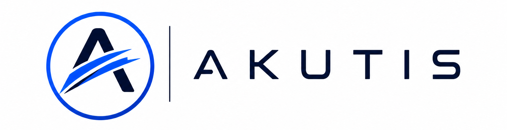

<p align="center">
  
</p>

# Akutis — Portfólio

Landing page do **Akutis**, plataforma mobile white-label para gestão de salões de beleza e barbearias. Cada negócio recebe uma instância isolada e customizável para gerenciar serviços, profissionais e clientes.

📄 Leia o [case study completo](AKUTIS_CASE_STUDY.md) para entender o problema de negócio, a solução e a arquitetura do produto.

## Stack

- [React 18](https://react.dev/) + [Vite 6](https://vite.dev/)
- [Tailwind CSS 4](https://tailwindcss.com/)
- [shadcn/ui](https://ui.shadcn.com/) (Radix UI)
- [Motion](https://motion.dev/) para animações
- [Lucide](https://lucide.dev/) para ícones

## Como rodar

Pré-requisitos: [Node.js](https://nodejs.org/) 20+ e [pnpm](https://pnpm.io/).

```bash
# Instalar dependências
pnpm install

# Servidor de desenvolvimento
pnpm dev

# Build de produção (gera dist/)
pnpm build

# Pré-visualizar o build
pnpm preview
```

## Estrutura

```
src/
├── app/
│   ├── App.tsx              # Landing page principal
│   └── components/
│       └── ui/              # Componentes shadcn/ui
├── imports/                 # Assets (logo)
├── styles/                  # Tema, fontes e Tailwind
└── main.tsx                 # Ponto de entrada
```

---

Desenvolvido por [Rodrigo Paulo](https://github.com/rodrigopaulodev) · Design prototipado no Figma Make
